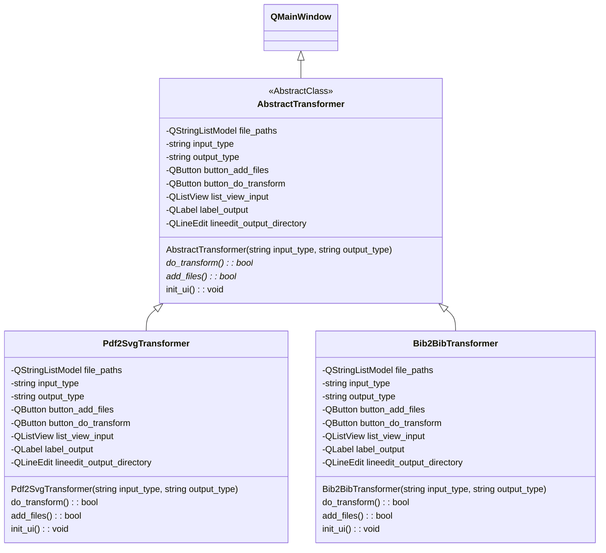

# 简介

# UML类图

```mermaid
classDiagram
    class QMainWindow
    class AbstractTransformer {
        <<AbstractClass>>
        -QStringListModel file_paths
        -string input_type
        -string output_type
        -QButton button_add_files
        -QButton button_do_transform
        -QListView list_view_input
        -QLabel label_output
        -QLineEdit lineedit_output_directory
        AbstractTransformer(string input_type, string output_type)
        do_transform()*: bool
        add_files()*: bool
        init_ui(): void
    }
    class Pdf2SvgTransformer {
        -QStringListModel file_paths
        -string input_type
        -string output_type
        -QButton button_add_files
        -QButton button_do_transform
        -QListView list_view_input
        -QLabel label_output
        -QLineEdit lineedit_output_directory
        Pdf2SvgTransformer(string input_type, string output_type)
        do_transform(): bool
        add_files(): bool
        init_ui(): void
    }
    class Bib2BibTransformer {
        -QStringListModel file_paths
        -string input_type
        -string output_type
        -QButton button_add_files
        -QButton button_do_transform
        -QListView list_view_input
        -QLabel label_output
        -QLineEdit lineedit_output_directory
        Bib2BibTransformer(string input_type, string output_type)
        do_transform(): bool
        add_files(): bool
        init_ui(): void
    }

    AbstractTransformer <|-- Pdf2SvgTransformer
    AbstractTransformer <|-- Bib2BibTransformer
    QMainWindow <|-- AbstractTransformer
```